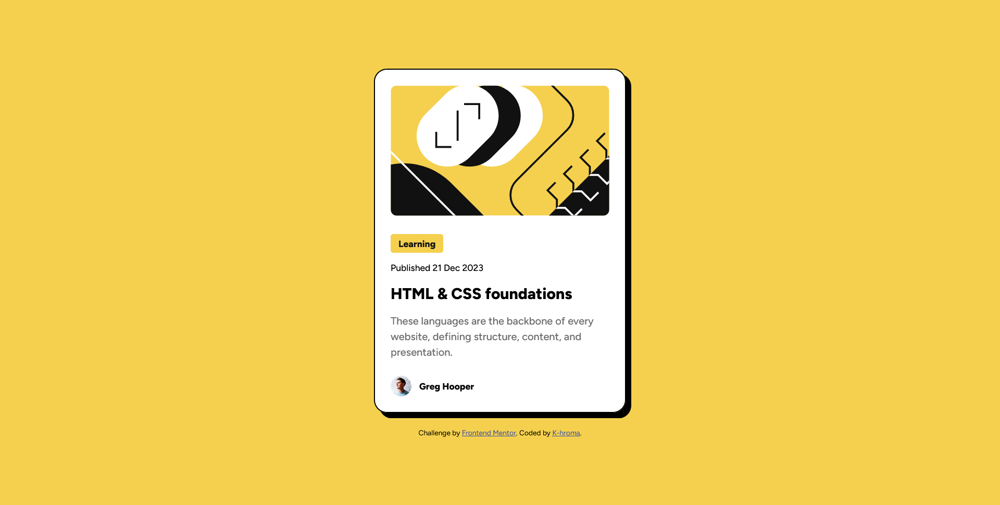

# Frontend Mentor - Blog preview card solution

This is a solution to the [Blog preview card challenge on Frontend Mentor](https://www.frontendmentor.io/challenges/blog-preview-card-ckPaj01IcS). Frontend Mentor challenges help you improve your coding skills by building realistic projects. 

## Table of contents

- [Overview](#overview)
- [The challenge](#the-challenge)
- [Screenshot](#screenshot)
- [Links](#links)
- [Built with](#built-with)
- [Author](#author)
- [Acknowledgments](#acknowledgments)

## Overview

Blog preview card | First solution using CSS and Flexbox

## The challenge

Users should be able to:

- See hover and focus states for all interactive elements on the page

## Screenshot

## Links

- Solution URL: [https://k-hroma.github.io/Blog-Preview-Card/]
- Live Site URL: [https://k-hroma.github.io/k-hroma-Blog-preview-card-css-and-flexbox/]
## My process

### Built with

- Semantic HTML5 markup
- CSS custom properties
- Flexbox

## Author

- Website - [Rocío Mendonca](https://www.linkedin.com/in/rocio-mendonca-gainza-/)
- Frontend Mentor - [@k-hroma](https://www.frontendmentor.io/profile/k-hroma)
